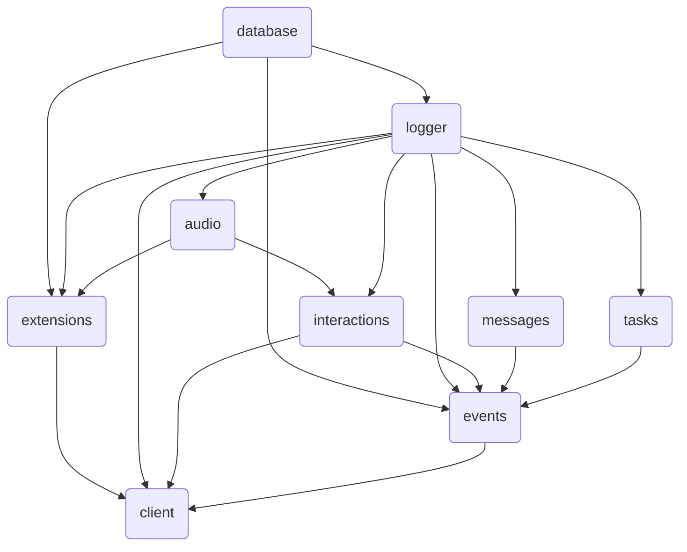

# automaton

A Discord bot written in Typescript.

## Setup

```bash
pnpm i -P
pnpm run db:generate
pnpm run db:deploy
```

## Structure


```mermaid
flowchart TD
    audio(audio)
    database(database)
    extensions(extensions)
    logger(logger)

    client(client)
    events(events)
    interactions(interactions)
    messages(messages)
    tasks(tasks)

    database --> logger

    logger --> audio

    database --> extensions
    logger --> extensions
    audio --> extensions

    logger --> tasks

    logger --> messages

    audio --> interactions
    logger --> interactions

    database --> events
    logger --> events
    interactions --> events
    messages --> events
    tasks --> events

    extensions --> client
    logger --> client
    interactions --> client
    events --> client
```
